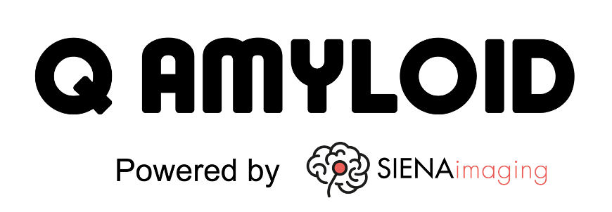

 

# Q Amyloid Platform – Enabling Accessible Amyloid Quantification

The ultimate goal of Q Amyloid is not to introduce new biological findings, but to democratise access to clinical centres by providing a scalable, transparent, and validated methodological tool for quantitative Aβ imaging. In doing so, it aims to support the development of Aβ-targeting therapies and enhance patient monitoring across research and routine clinical practice.

## 📋 Gain Access to the platform  
To configure a secure service and access the platform, a certificate must be generated and installed on your computer. 
To create your account, fill in the form at this link: https://docs.google.com/forms/d/e/1FAIpQLSd3liL1fg8f9BLAtlgN7KQRypPxO8I4oZXz0wWTd-zhfMoZlA/viewform?usp=header

## 📖 User Manual
To learn how Q Amyloid works, please refer to the user manual included in this repository.  
The manual provides detailed instructions on: 
- Get the certificate and log-in
- Development choices 
- Main features
- Practical examples

## 🤝 Contributions
The project welcomes scientific and industrial collaborations.  
To suggest improvements or report issues, please use the **Issues** section on GitHub or contact us.

## © Copyright
All content included on the Q Amyloid Site, such as text, graphics, logos, button icons, images, page layout and underlying code are regulated by Q Amyloid project and its associated funding bodies. By continuing to use the site you acknowledge that such contents are protected by copyright, database rights and other intellectual property rights. You can only use our copyrights or any of the content from the website with our prior written permission. 

## 🔑 Contact us 
If your **clinical center, university, or company** is interested in gaining access to Q Amyloid, please contact:  
📧 **qamyloid@dei.unipd.it**
